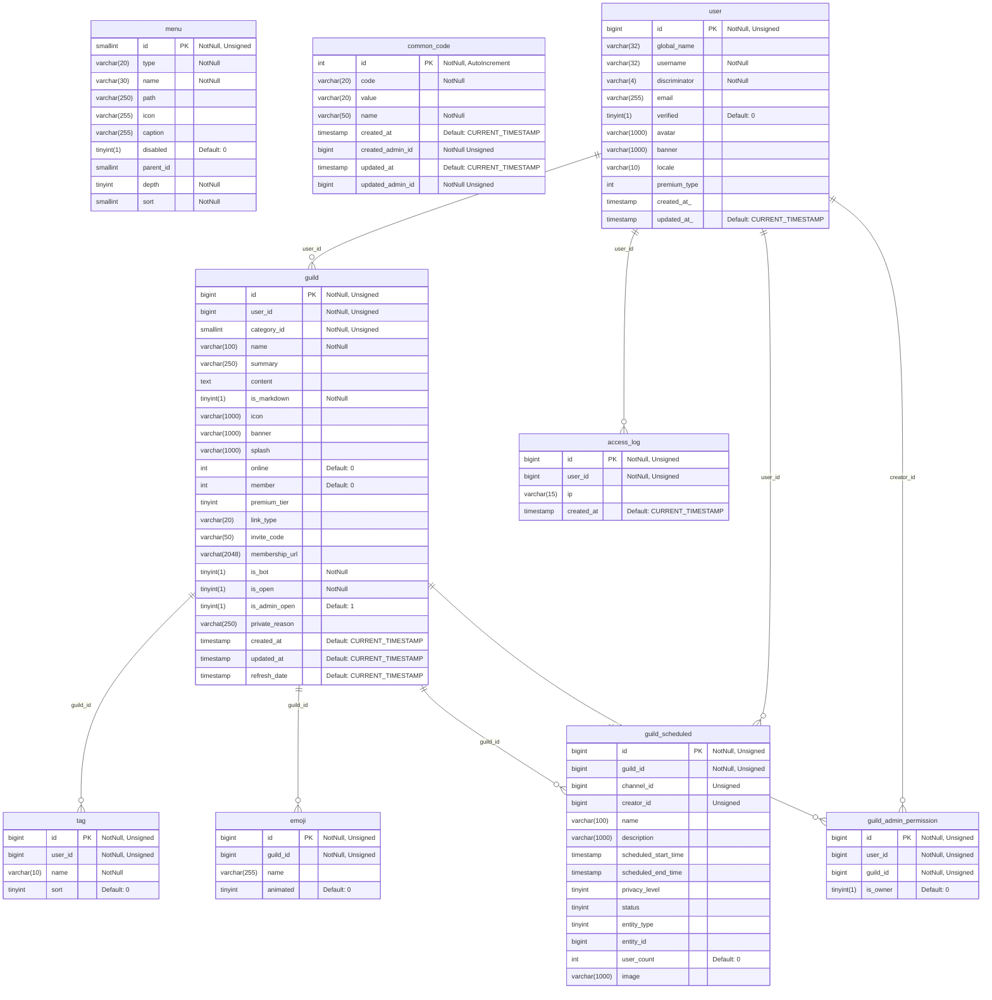

# Disnity ERD

Disnity 서비스 ERD 입니다.

[mermaid](https://mermaid.js.org/) - Diagramming and charting tool

```mermaid
erDiagram
    menu {
        smallint id PK "NotNull, Unsigned"
        varchar(20) type "NotNull"
        varchar(30) name "NotNull"
        varchar(250) path
        varchar(255) icon
        varchar(255) caption
        tinyint(1) disabled "Default: 0"
        smallint parent_id
        tinyint depth "NotNull"
        smallint sort "NotNull"
    }

    common_code {
        int id PK "NotNull, AutoIncrement"
        varchar(20) code "NotNull"
        varchar(20) value
        varchar(50) name "NotNull"
        timestamp created_at "Default: CURRENT_TIMESTAMP"
        bigint created_admin_id "NotNull Unsigned"
        timestamp updated_at "Default: CURRENT_TIMESTAMP"
        bigint updated_admin_id "NotNull Unsigned"
    }


    user ||--o{ guild : user_id
    user ||--o{ access_log : user_id
    user ||--o{ guild_scheduled : user_id
    user ||--o{ guild_admin_permission : creator_id
    user {
        bigint id PK "NotNull, Unsigned"
        varchar(32) global_name
        varchar(32) username "NotNull"
        varchar(4) discriminator "NotNull"
        varchar(255) email
        tinyint(1) verified "Default: 0"
        varchar(1000) avatar
        varchar(1000) banner
        varchar(10) locale
        int premium_type
        timestamp created_at_
        timestamp updated_at_ "Default: CURRENT_TIMESTAMP"
    }

    access_log {
        bigint id PK "NotNull, Unsigned"
        bigint user_id "NotNull, Unsigned"
        varchar(15) ip
        timestamp created_at "Default: CURRENT_TIMESTAMP"
    }

    guild ||--o{ tag : guild_id
    guild ||--o{ emoji : guild_id
    guild ||--o{ guild_scheduled : guild_id
    guild ||--o{ guild_admin_permission : guild_id
        guild {
        bigint id PK "NotNull, Unsigned"
        bigint user_id "NotNull, Unsigned"
        smallint category_id "NotNull, Unsigned"
        varchar(100) name "NotNull"
        varchar(250) summary
        text content
        tinyint(1) is_markdown "NotNull"
        varchar(1000) icon
        varchar(1000) banner
        varchar(1000) splash
        int online "Default: 0"
        int member "Default: 0"
        tinyint premium_tier
        varchar(20) link_type
        varchar(50) invite_code
        varchat(2048) membership_url
        tinyint(1) is_bot "NotNull"
        tinyint(1) is_open "NotNull"
        tinyint(1) is_admin_open "Default: 1"
        varchat(250) private_reason
        timestamp created_at "Default: CURRENT_TIMESTAMP"
        timestamp updated_at "Default: CURRENT_TIMESTAMP"
        timestamp refresh_date "Default: CURRENT_TIMESTAMP"
    }

    tag {
        bigint id PK "NotNull, Unsigned"
        bigint user_id "NotNull, Unsigned"
        varchar(10) name "NotNull"
        tinyint sort "Default: 0"
    }

    emoji {
        bigint id PK "NotNull, Unsigned"
        bigint guild_id "NotNull, Unsigned"
        varchar(255) name
        tinyint animated "Default: 0"
    }

    guild_admin_permission {
        bigint id PK "NotNull, Unsigned"
        bigint user_id "NotNull, Unsigned"
        bigint guild_id "NotNull, Unsigned"
        tinyint(1) is_owner "Default: 0"
    }

    guild_scheduled {
        bigint id PK "NotNull, Unsigned"
        bigint guild_id "NotNull, Unsigned"
        bigint channel_id "Unsigned"
        bigint creator_id "Unsigned"
        varchar(100) name
        varchar(1000) description
        timestamp scheduled_start_time
        timestamp scheduled_end_time
        tinyint privacy_level
        tinyint status
        tinyint entity_type
        bigint entity_id
        int user_count "Default: 0"
        varchar(1000) image
    }
```
